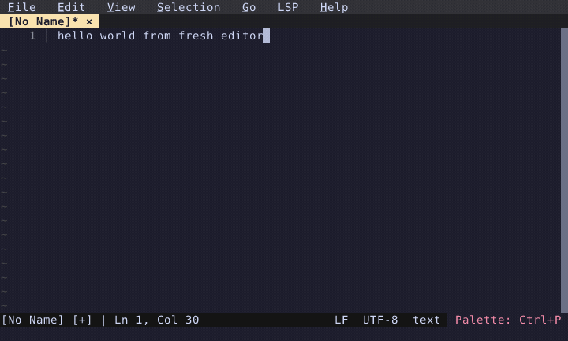

# Case Conversion

Convert selected text to uppercase (Alt+U) or lowercase (Alt+L).

  

<!-- Generated by: cargo test --package fresh-editor --test e2e_tests blog_showcase_editing/case-conversion -- --ignored -->
<!-- Then run: scripts/frames-to-gif.sh docs/blog/editing/case-conversion -->
