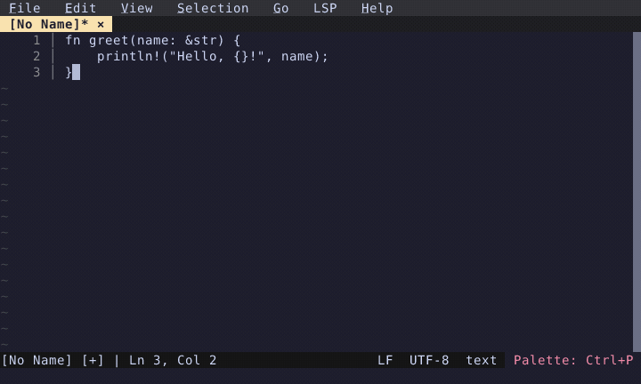

# Duplicate Line

Duplicate the current line with a single command.

  

<!-- Generated by: cargo test --package fresh-editor --test e2e_tests blog_showcase_editing/duplicate-line -- --ignored -->
<!-- Then run: scripts/frames-to-gif.sh docs/blog/editing/duplicate-line -->
