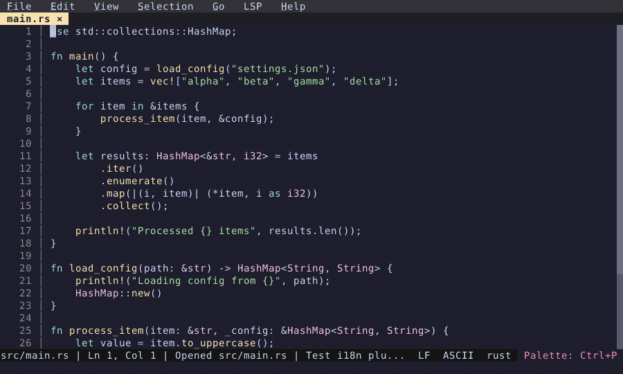

# Multi-Cursor Editing

Select multiple occurrences and edit them all at once.

  

<!-- Generated by: cargo test --package fresh-editor --test e2e_tests blog_showcase_editing/multi-cursor -- --ignored -->
<!-- Then run: scripts/frames-to-gif.sh docs/blog/editing/multi-cursor -->
