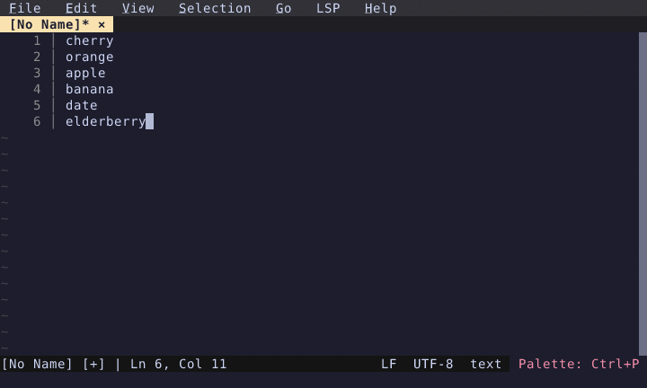

# Sort Lines

Select lines and sort them alphabetically via command palette.

  

<!-- Generated by: cargo test --package fresh-editor --test e2e_tests blog_showcase_editing/sort-lines -- --ignored -->
<!-- Then run: scripts/frames-to-gif.sh docs/blog/editing/sort-lines -->
