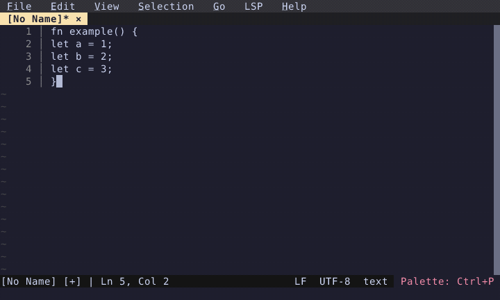

# Tab Indent Selection

Tab indents selected lines, Shift+Tab dedents.

  

<!-- Generated by: cargo test --package fresh-editor --test e2e_tests blog_showcase_editing/tab-indent -- --ignored -->
<!-- Then run: scripts/frames-to-gif.sh docs/blog/editing/tab-indent -->
