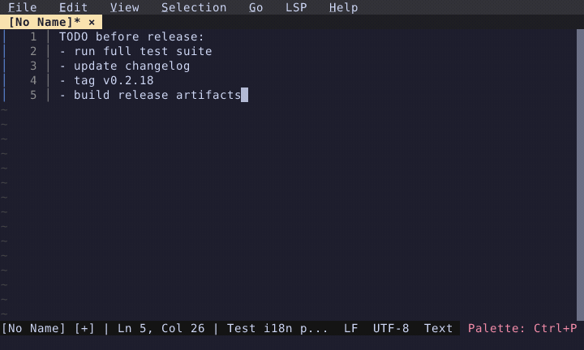

# Hot Exit

Unnamed scratch buffers persist across editor restarts — never lose your quick notes.

  

<!-- Generated by: cargo test --package fresh-editor --test e2e_tests blog_showcase_fresh-0.2.18/hot-exit -- --ignored -->
<!-- Then run: scripts/frames-to-gif.sh docs/blog/fresh-0.2.18/hot-exit -->
