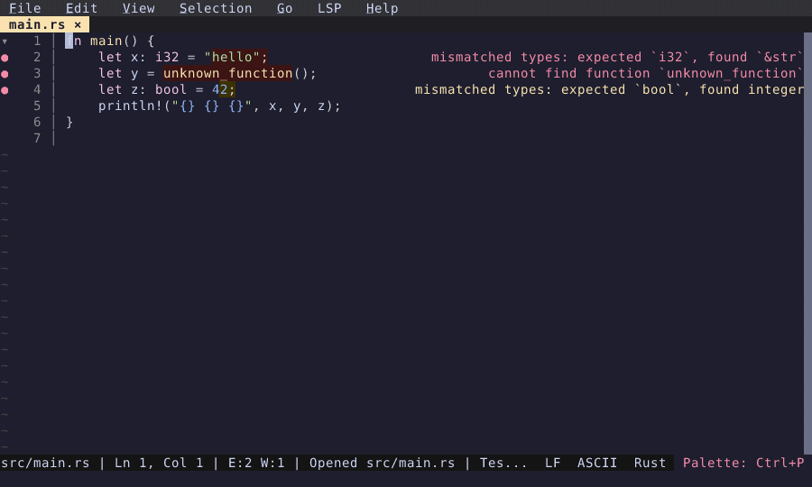

# Inline Diagnostics

Diagnostic messages displayed right-aligned at the end of each line.

  

<!-- Generated by: cargo test --package fresh-editor --test e2e_tests blog_showcase_fresh-0.2.18/inline-diagnostics -- --ignored -->
<!-- Then run: scripts/frames-to-gif.sh docs/blog/fresh-0.2.18/inline-diagnostics -->
