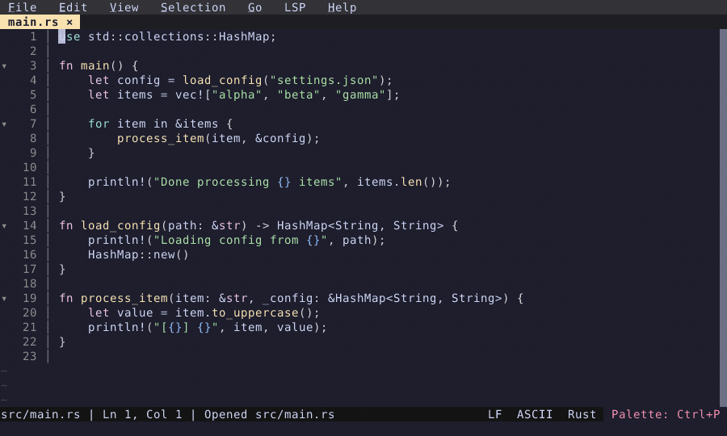

# Project-Wide Search & Replace

Search and replace across your entire project. Alt+Enter to replace all matches.

  

<!-- Generated by: cargo test --package fresh-editor --test e2e_tests blog_showcase_fresh-0.2.18/project-search-replace -- --ignored -->
<!-- Then run: scripts/frames-to-gif.sh docs/blog/fresh-0.2.18/project-search-replace -->
