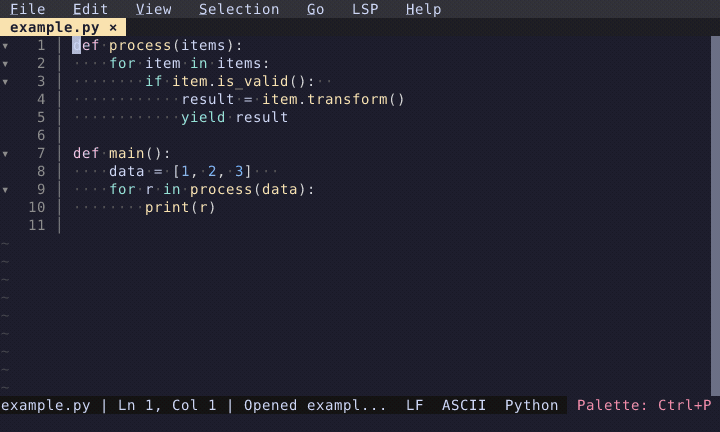

# Whitespace Indicators

Granular control over space and tab visibility — leading, inner, trailing, or all.

  

<!-- Generated by: cargo test --package fresh-editor --test e2e_tests blog_showcase_fresh-0.2.18/whitespace-indicators -- --ignored -->
<!-- Then run: scripts/frames-to-gif.sh docs/blog/fresh-0.2.18/whitespace-indicators -->
