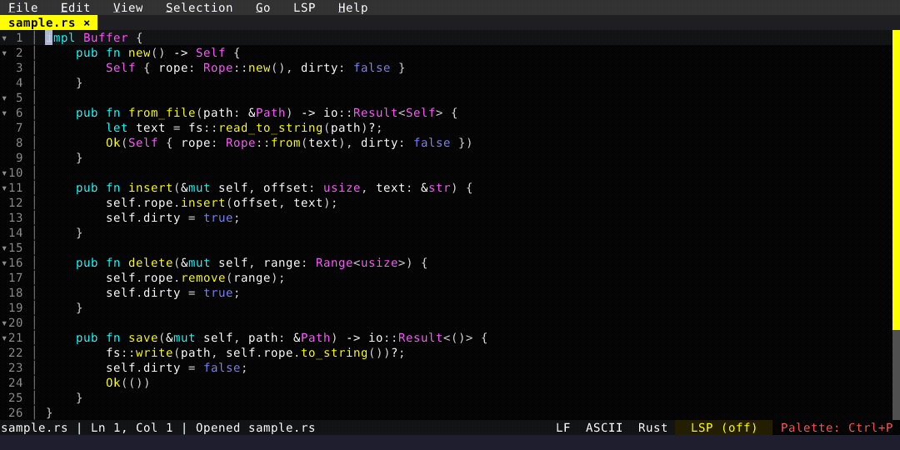

# Flash Jump

Type a pattern, press a label, jump anywhere visible.

  

<!-- Generated by: cargo test --package fresh-editor --test e2e_tests blog_showcase_productivity/flash-jump -- --ignored -->
<!-- Then run: scripts/frames-to-gif.sh docs/blog/productivity/flash-jump -->
