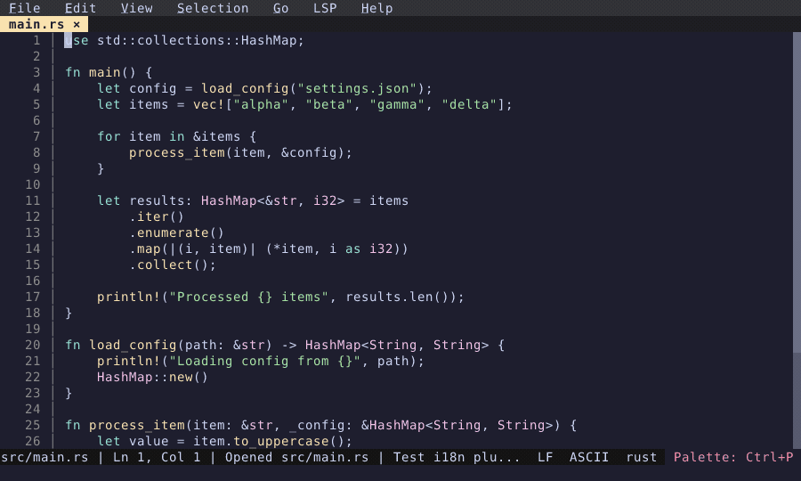

# Settings UI

Graphical editor for all configuration options.

  

<!-- Generated by: cargo test --package fresh-editor --test e2e_tests blog_showcase_productivity/settings -- --ignored -->
<!-- Then run: scripts/frames-to-gif.sh docs/blog/productivity/settings -->
