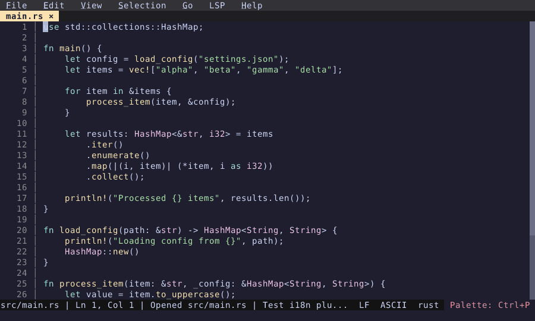

# Select Theme

Browse and apply color themes from the command palette.

  

<!-- Generated by: cargo test --package fresh-editor --test e2e_tests blog_showcase_themes/select-theme -- --ignored -->
<!-- Then run: scripts/frames-to-gif.sh docs/blog/themes/select-theme -->
